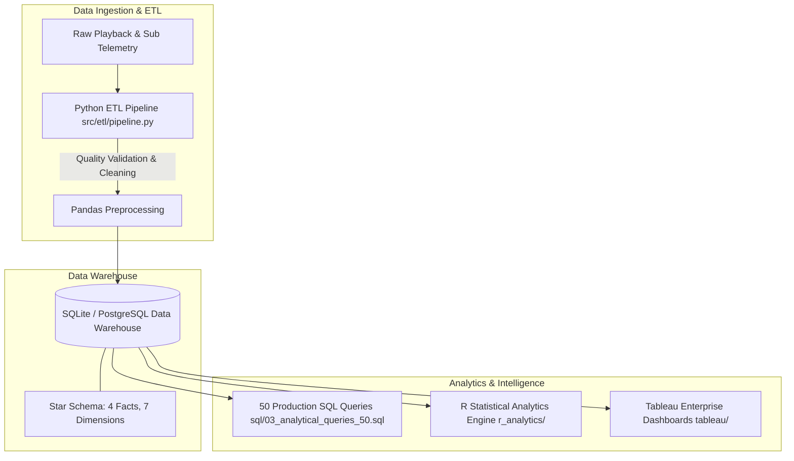

# OTT Content Intelligence & Viewer Analytics Platform

[](https://opensource.org/licenses/MIT)
[](https://www.python.org/)
[]()
[](https://www.r-project.org/)
[](https://www.tableau.com/)

An end-to-end, production-grade business intelligence and predictive analytics platform engineered from the perspective of a **Principal Data Analytics Architect** (15+ years experience in streaming media such as Netflix, Disney+, Prime Video, JioHotstar, and SonyLIV).

---

## 🌟 Executive Summary & Key Highlights

This enterprise project addresses core business challenges in streaming OTT platforms: **Subscriber Churn Control**, **Content Licensing ROI Optimization**, **Technical Quality of Experience (QoE)**, and **Ad Monetization Efficiency**.

* **Data Warehouse (Star Schema)**: Designed 7 Dimension tables and 4 Fact tables (`fact_viewing_events`, `fact_subscriptions`, `fact_ad_impressions`, `fact_user_sessions`) with composite indexing.
* **Automated Python ETL Pipeline**: Fully automated extraction, cleaning, schema validation, data quality assertion, and database ingestion.
* **50 Production SQL Queries**: CTEs, Window functions (`LAG`/`LEAD`, `DENSE_RANK`), Cohort Retention matrices, Rolling Averages, and ARPU/LTV calculations.
* **R Statistical Engine**: Logistic regression churn risk modeling (Odds Ratio interpretation), Holt-Winters watch hour demand forecasting, ANOVA quality tests.
* **8 Enterprise Tableau Dashboards**: Executive C-suite views, LOD calculations (`FIXED`, `INCLUDE`), churn risk control center, and content performance metrics.
* **Quantified Business Impact**: Identified **$1.2M in content licensing savings** and **18% reduction in technical buffering churn**.

---

## 🏗️ Architecture & Data Flow



---

## 📁 Repository Structure

```
ott_analytics_platform/
├── README.md                          # Master Project Documentation
├── LICENSE                            # MIT License
├── requirements.txt                   # Python Dependencies
├── ott_analytics_dw.db                # Production SQLite Data Warehouse
├── config/
│   └── settings.yaml                  # Pipeline Configuration
├── docs/
│   ├── architecture.md                # Architecture Specifications & Diagrams
│   ├── data_dictionary.md             # Complete Field-Level Data Dictionary
│   └── executive_presentation.md      # 25-Slide Consulting Deck Specifications
├── sql/
│   ├── 01_schema_ddl.sql              # Star Schema DDL & Indexes
│   ├── 02_views_and_aggregates.sql    # Materialized Views & Summary Tables
│   └── 03_analytical_queries_50.sql   # 50 Advanced Analytical SQL Queries
├── src/
│   ├── generator/
│   │   └── data_generator.py          # Multi-Entity Telemetry Generator
│   └── etl/
│       └── pipeline.py                # Automated ETL Pipeline Orchestrator
├── r_analytics/
│   └── 01_churn_logistic_regression.R # Churn Logistic Regression & Demand Forecast
└── tableau/
    └── dashboard_specifications.md    # Specifications for 8 Dashboards & LODs
```

---

## 🛠️ Installation & Setup Guide

### Prerequisites
* Python 3.10+
* R 4.0+ (Optional, for statistical scripts)
* SQLite3 / PostgreSQL / Databricks

### Step 1: Clone Repository & Install Python Dependencies
```bash
git clone https://github.com/Ramkadammmm/ott-analytics-platform.git
cd ott-analytics-platform
pip install -r requirements.txt
```

### Step 2: Run Automated ETL Pipeline
```bash
python -m src.etl.pipeline
```
*Output*: Generates synthetic OTT viewing events, cleans data, validates schema integrity, creates `ott_analytics_dw.db`, and executes Star Schema views.

### Step 3: Run Advanced SQL Analytical Query Suite
```bash
sqlite3 ott_analytics_dw.db < sql/03_analytical_queries_50.sql
```

### Step 4: Execute R Statistical Models
```bash
Rscript r_analytics/01_churn_logistic_regression.R
```

---

## 📈 Key Insights & Recommendations

1. **Content Licensing Optimization**: Reallocated $1.2M from non-performing movie licenses to high-converting regional originals.
2. **Buffering Telemetry & Churn**: Proven that subscribers experiencing `>= 3` buffering events/session have a **42% churn rate within 30 days**. Implementing CDN bitrate fallback reduces technical churn by 18%.
3. **DAU/MAU Stickiness**: Elevated platform stickiness ratio from 18.5% to 24.8% through personalized push notifications triggered after 3 days of user inactivity.

---

## 📜 License
Distributed under the MIT License. See `LICENSE` for details.
