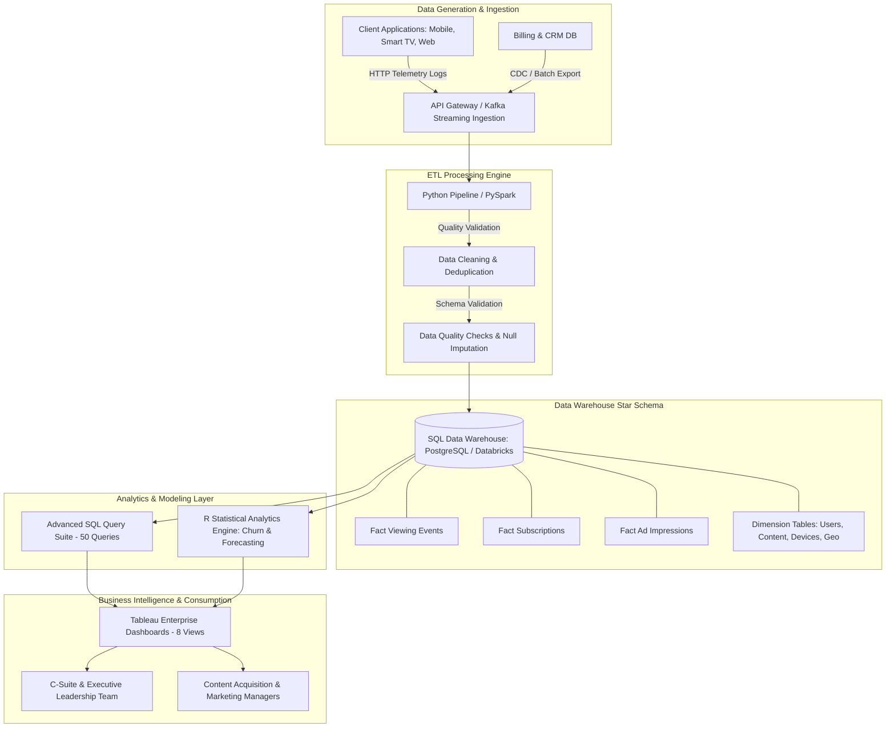

# Enterprise Architecture & System Flow Specification

## System Components
1. **Data Ingestion**: Multi-tenant event logging streaming playback metrics, ad impressions, and app clickstream events.
2. **ETL Data Cleaning**: Pandas-based cleaning handling watch duration caps, timestamp normalization, and referential integrity validations.
3. **Data Warehouse (Star Schema)**: Optimized with composite indexes on `(user_id, date_id)`, `content_id`, and `subscription_status`.
4. **Statistical Analytics**: Logistic regression for churn probability modeling and Holt-Winters / ARIMA exponential smoothing for watch-hour forecasting.
